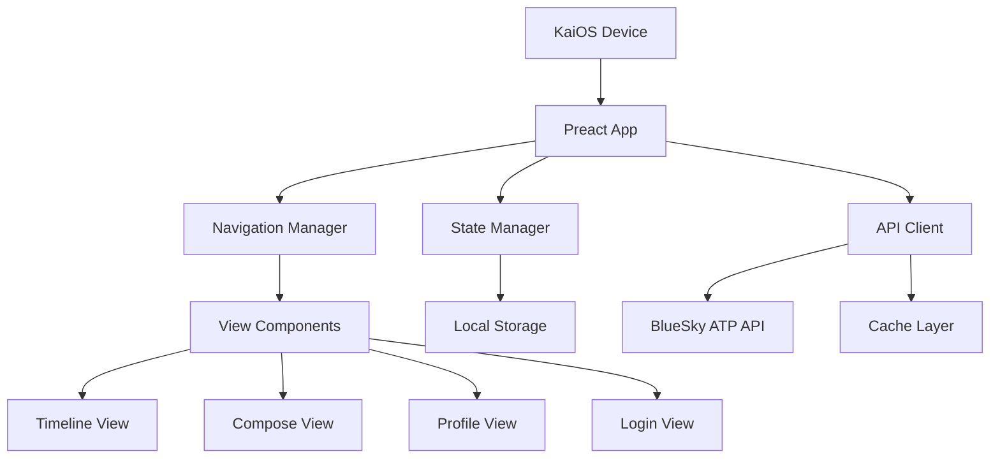

# BlueKai Design Document

## Overview

BlueKai is a lightweight BlueSky client for KaiOS 2.5 flip phones, built with Preact to minimize bundle size and optimized for Gecko 48 compatibility. The application follows a simple, navigation-friendly architecture that prioritizes data efficiency and offline resilience.

### Key Design Principles

1. **Minimal Bundle Size**: Target <200KB gzipped through careful dependency selection and code splitting
2. **Gecko 48 Compatibility**: Use only ES5-compatible JavaScript with polyfills where necessary
3. **D-pad First Navigation**: Design all interactions around KaiOS physical navigation
4. **Data Efficiency**: Implement aggressive caching and optional media loading
5. **Progressive Enhancement**: Core functionality works with minimal resources

## Architecture

### High-Level Architecture



### Technology Stack

- **UI Framework**: Preact 10.x (3KB alternative to React)
- **State Management**: Preact hooks + Context API (no external library needed)
- **HTTP Client**: Native `XMLHttpRequest` (Fetch API not available in Gecko 48)
- **Build Tool**: Webpack 4.x with Babel for ES5 transpilation
- **Storage**: LocalStorage API for session and cache data
- **Routing**: Custom lightweight router (~1KB)

### Browser Compatibility Strategy

**Gecko 48 Limitations:**
- No Fetch API (use XMLHttpRequest)
- No async/await (use Promises with transpilation)
- No ES6 modules natively (bundle with Webpack)
- Limited CSS Grid support (use Flexbox)
- No Service Workers (use AppCache or simple caching)

**Polyfills Required:**
- Promise polyfill (if not present)
- Object.assign polyfill
- Array methods (find, findIndex, includes)

## Components and Interfaces

### Component Hierarchy

```
App
├── Router
│   ├── LoginView
│   ├── TimelineView
│   │   ├── PostList
│   │   │   └── PostItem
│   │   └── LoadingIndicator
│   ├── ComposeView
│   │   ├── TextArea
│   │   └── CharacterCounter
│   ├── PostDetailView
│   │   ├── PostItem
│   │   └── ReplyList
│   ├── ProfileView
│   │   ├── ProfileHeader
│   │   └── PostList
│   ├── EditProfileView
│   │   ├── TextInput (Display Name)
│   │   ├── TextArea (Bio)
│   │   └── CharacterCounter
│   └── NotificationsView
│       └── NotificationList
├── NavigationBar (Softkeys)
└── ErrorBoundary
```

### Core Components

#### 1. Navigation Manager

Handles D-pad and softkey input for KaiOS navigation.

```javascript
// Simplified interface
class NavigationManager {
  constructor(options) {
    this.focusableElements = [];
    this.currentIndex = 0;
    this.onSelect = options.onSelect;
  }
  
  handleKeyDown(event) {
    // ArrowUp, ArrowDown, ArrowLeft, ArrowRight
    // Enter for selection
    // SoftLeft, SoftRight for context actions
  }
  
  updateFocusableElements(elements) {
    // Refresh list of navigable items
  }
  
  moveFocus(direction) {
    // Update focus index and apply visual focus
  }
}
```

**Key Features:**
- Circular navigation (wrap around at list ends)
- Visual focus indicators with high contrast
- Softkey context updates based on focused element
- Number key shortcuts for quick actions

#### 2. API Client

Handles all communication with BlueSky ATP API.

```javascript
// ATP API Client Interface
class ATPClient {
  constructor(config) {
    this.baseURL = 'https://bsky.social';
    this.session = null;
  }
  
  // Authentication
  async login(identifier, password) {
    // POST /xrpc/com.atproto.server.createSession
    // Returns: { accessJwt, refreshJwt, handle, did }
  }
  
  async refreshSession() {
    // POST /xrpc/com.atproto.server.refreshSession
  }
  
  // Timeline
  async getTimeline(options) {
    // GET /xrpc/app.bsky.feed.getTimeline
    // Params: algorithm, limit, cursor
  }
  
  // Posts
  async createPost(text, reply) {
    // POST /xrpc/com.atproto.repo.createRecord
  }
  
  async likePost(uri, cid) {
    // POST /xrpc/com.atproto.repo.createRecord
  }
  
  async repost(uri, cid) {
    // POST /xrpc/com.atproto.repo.createRecord
  }
  
  // Profile
  async getProfile(actor) {
    // GET /xrpc/app.bsky.actor.getProfile
  }
  
  async updateProfile(updates) {
    // PUT /xrpc/com.atproto.repo.putRecord
    // Updates: displayName, description, avatar, banner
  }
  
  // Notifications
  async getNotifications(options) {
    // GET /xrpc/app.bsky.notification.listNotifications
  }
}
```

**Implementation Notes:**
- Use XMLHttpRequest wrapped in Promises
- Implement exponential backoff for retries
- Handle rate limiting (429 responses)
- Store JWT tokens securely in LocalStorage

#### 3. State Manager

Global application state using Preact Context.

```javascript
// State structure
const AppState = {
  user: {
    did: null,
    handle: null,
    displayName: null,
    avatar: null
  },
  session: {
    accessJwt: null,
    refreshJwt: null,
    expiresAt: null
  },
  timeline: {
    posts: [],
    cursor: null,
    loading: false,
    error: null
  },
  settings: {
    dataSaverMode: false,
    autoLoadImages: true,
    language: 'en'
  },
  navigation: {
    currentView: 'timeline',
    history: []
  }
};
```

**State Management Pattern:**
- Use `useReducer` hook for complex state updates
- Context Provider at app root
- Local component state for UI-only concerns
- Persist critical state to LocalStorage

#### 4. Cache Layer

Implements data caching to minimize network requests.

```javascript
class CacheManager {
  constructor(storage) {
    this.storage = storage; // LocalStorage wrapper
    this.maxAge = 5 * 60 * 1000; // 5 minutes
  }
  
  set(key, data, ttl) {
    // Store with timestamp
  }
  
  get(key) {
    // Return if not expired, null otherwise
  }
  
  clear(pattern) {
    // Clear matching keys
  }
  
  prune() {
    // Remove expired entries
  }
}
```

**Caching Strategy:**
- Timeline: 5 minute TTL
- Profile data: 15 minute TTL
- User session: Until logout
- Media URLs: Session-based
- Implement LRU eviction when storage limit approached

### View Components

#### TimelineView

Displays the user's home timeline with infinite scroll.

**Features:**
- Virtual scrolling for performance (render only visible items + buffer)
- Pull-to-refresh simulation (softkey action)
- Cursor-based pagination
- Loading states and error handling

#### ComposeView

Text composition interface for creating posts and replies.

**Features:**
- Character counter (300 max)
- Reply context display
- Draft auto-save to LocalStorage
- Confirmation on cancel if text entered

#### PostDetailView

Shows a single post with its reply thread.

**Features:**
- Full post content
- Reply thread (nested up to 3 levels)
- Action menu (like, repost, reply)

#### ProfileView

Displays user profile and their posts.

**Features:**
- Profile metadata (avatar, bio, follower count)
- User's post history
- Follow/unfollow action (if not own profile)
- Edit profile action (if own profile)

#### EditProfileView

Allows users to update their profile information.

**Features:**
- Edit display name
- Edit bio/description
- Character limits and validation
- Save/cancel actions
- Loading and error states

## Data Models

### Post Model

```javascript
{
  uri: "at://did:plc:xxx/app.bsky.feed.post/xxx",
  cid: "bafyxxx",
  author: {
    did: "did:plc:xxx",
    handle: "user.bsky.social",
    displayName: "User Name",
    avatar: "https://cdn.bsky.app/img/avatar/..."
  },
  record: {
    text: "Post content",
    createdAt: "2025-11-23T12:00:00.000Z",
    reply: {
      parent: { uri: "...", cid: "..." },
      root: { uri: "...", cid: "..." }
    },
    embed: {
      // Images, external links, quotes, etc.
    }
  },
  replyCount: 5,
  repostCount: 10,
  likeCount: 25,
  viewer: {
    like: "at://...", // URI if user liked
    repost: "at://..." // URI if user reposted
  }
}
```

### Session Model

```javascript
{
  accessJwt: "eyJxxx...",
  refreshJwt: "eyJxxx...",
  handle: "user.bsky.social",
  did: "did:plc:xxx",
  email: "user@example.com", // optional
  expiresAt: 1700000000000 // timestamp
}
```

### User Profile Model

```javascript
{
  did: "did:plc:xxx",
  handle: "user.bsky.social",
  displayName: "User Name",
  description: "Bio text",
  avatar: "https://cdn.bsky.app/img/avatar/...",
  banner: "https://cdn.bsky.app/img/banner/...",
  followersCount: 100,
  followsCount: 50,
  postsCount: 200,
  viewer: {
    following: "at://...", // URI if current user follows
    followedBy: "at://..." // URI if they follow current user
  }
}
```

## Error Handling

### Error Categories

1. **Network Errors**
   - Connection timeout
   - DNS resolution failure
   - Server unreachable
   - **Handling**: Show "Connection failed" message, offer retry

2. **Authentication Errors**
   - Invalid credentials (401)
   - Expired session (401)
   - **Handling**: Clear session, redirect to login

3. **API Errors**
   - Rate limiting (429)
   - Invalid request (400)
   - Server error (500)
   - **Handling**: Show specific error message, log details

4. **Client Errors**
   - Storage quota exceeded
   - Invalid state
   - **Handling**: Clear cache, reset to safe state

### Error Display Strategy

```javascript
// Error message mapping
const ERROR_MESSAGES = {
  'NetworkError': 'Cannot connect. Check your connection.',
  'AuthError': 'Login expired. Please sign in again.',
  'RateLimitError': 'Too many requests. Please wait.',
  'ServerError': 'BlueSky is having issues. Try again later.',
  'StorageError': 'Storage full. Clearing cache...'
};
```

**User Feedback:**
- Toast notifications for non-critical errors
- Modal dialogs for critical errors requiring action
- Inline error messages for form validation
- Retry buttons where applicable

## Testing Strategy

### Unit Testing

**Framework**: None (keep bundle small)
**Approach**: Manual testing with test HTML pages

**Test Coverage:**
- API client methods (mock XMLHttpRequest)
- State reducer functions
- Cache manager operations
- Navigation manager logic
- Utility functions (date formatting, text truncation)

### Integration Testing

**Manual Test Scenarios:**
1. Login flow with valid/invalid credentials
2. Timeline loading and pagination
3. Post creation and submission
4. Like/repost/reply actions
5. Navigation between views
6. Offline behavior
7. Session expiration handling

### Device Testing

**Target Devices:**
- Nokia 8110 4G (KaiOS 2.5)
- Nokia 2720 Flip (KaiOS 2.5)
- Nokia 800 Tough (KaiOS 2.5)

**Test Matrix:**
- Fresh install
- Upgrade scenario (if applicable)
- Low memory conditions
- Poor network conditions (throttled)
- Airplane mode (offline)

### Performance Testing

**Metrics:**
- Initial load time: <3 seconds
- Time to interactive: <4 seconds
- Bundle size: <200KB gzipped
- Memory usage: <50MB
- Frame rate: Smooth scrolling (no jank)

**Tools:**
- Webpack Bundle Analyzer
- Chrome DevTools (throttled to simulate KaiOS)
- Manual stopwatch timing on device

## Build and Deployment

### Build Configuration

```javascript
// webpack.config.js (simplified)
module.exports = {
  entry: './src/index.js',
  output: {
    filename: 'bundle.js',
    path: './dist'
  },
  module: {
    rules: [
      {
        test: /\.jsx?$/,
        use: {
          loader: 'babel-loader',
          options: {
            presets: [
              ['@babel/preset-env', {
                targets: { firefox: '48' },
                useBuiltIns: 'usage',
                corejs: 3
              }],
              '@babel/preset-react'
            ]
          }
        }
      }
    ]
  },
  optimization: {
    minimize: true,
    usedExports: true // Tree shaking
  }
};
```

### Deployment Strategy

**Hosting Options:**
1. Static hosting (GitHub Pages, Netlify, Vercel)
2. CDN distribution for global access
3. Progressive Web App manifest for installation

**Distribution:**
- Web URL that users can bookmark
- Potential KaiStore submission (if applicable)
- QR code for easy access

### Development Workflow

1. **Local Development**: Webpack dev server with hot reload
2. **Testing**: Manual testing on KaiOS simulator or device
3. **Build**: Production build with minification
4. **Deploy**: Push to static hosting
5. **Monitor**: Track errors via simple logging endpoint

## Security Considerations

### Authentication Security

- Store JWT tokens in LocalStorage (no HttpOnly cookies in KaiOS)
- Clear tokens on logout
- Implement token refresh before expiration
- Never log sensitive data

### Data Privacy

- No analytics or tracking by default
- Minimal data collection
- Clear privacy policy
- User control over cached data

### Input Validation

- Sanitize user input before display (XSS prevention)
- Validate post length client-side
- Validate URLs before opening
- Escape HTML in post content

## Accessibility

### Screen Reader Support

- Semantic HTML elements (`<nav>`, `<article>`, `<button>`)
- ARIA labels for icon buttons
- ARIA live regions for dynamic content
- Proper heading hierarchy

### Visual Design

- High contrast text (WCAG AA minimum)
- Focus indicators with 3:1 contrast ratio
- Readable font sizes (minimum 14px)
- No color-only information

### Keyboard Navigation

- All functionality accessible via D-pad
- Logical tab order
- Skip navigation links
- Escape key to close modals

## Internationalization

### Language Support

**Initial Languages:**
- English (en)
- Spanish (es)
- French (fr)
- Portuguese (pt)

**Implementation:**
- JSON language files
- Simple key-based lookup
- Detect device language
- Fallback to English

### Localization Considerations

- Date/time formatting per locale
- Number formatting
- Text direction (RTL support future consideration)
- Cultural appropriateness of UI patterns

## Performance Optimization

### Bundle Size Optimization

1. **Tree Shaking**: Remove unused code
2. **Code Splitting**: Separate vendor and app code
3. **Minification**: UglifyJS for ES5 compatibility
4. **Compression**: Gzip all assets
5. **No Source Maps**: In production

### Runtime Optimization

1. **Virtual Scrolling**: Render only visible items
2. **Memoization**: Cache computed values
3. **Debouncing**: Limit rapid event handlers
4. **Lazy Loading**: Load images on demand
5. **Request Batching**: Combine API calls where possible

### Memory Management

1. **Cache Pruning**: Remove old entries
2. **Event Cleanup**: Remove listeners on unmount
3. **Limit Timeline**: Keep max 100 posts in memory
4. **Image Cleanup**: Clear blob URLs

## Future Enhancements

### Phase 2 Features (Post-MVP)

- Direct messages
- Search functionality
- Lists and feeds
- Mute and block
- Custom feed algorithms
- Media upload (photos)

### Technical Improvements

- Service Worker for better offline support (if KaiOS 3.0 support added)
- IndexedDB for larger cache (if needed)
- WebSocket for real-time updates (if supported)
- Push notifications (if KaiOS supports)

## Open Questions

1. **Image Handling**: Should we support image uploads or view-only?
   - **Decision**: View-only for MVP, uploads in Phase 2
   
2. **Offline Posting**: Queue posts when offline?
   - **Decision**: Show error, don't queue (complexity vs. value)
   
3. **Thread Depth**: How many reply levels to show?
   - **Decision**: 3 levels max, then "View more" link
   
4. **Cache Size**: What's the LocalStorage limit on KaiOS?
   - **Decision**: Assume 5MB, implement monitoring and pruning
